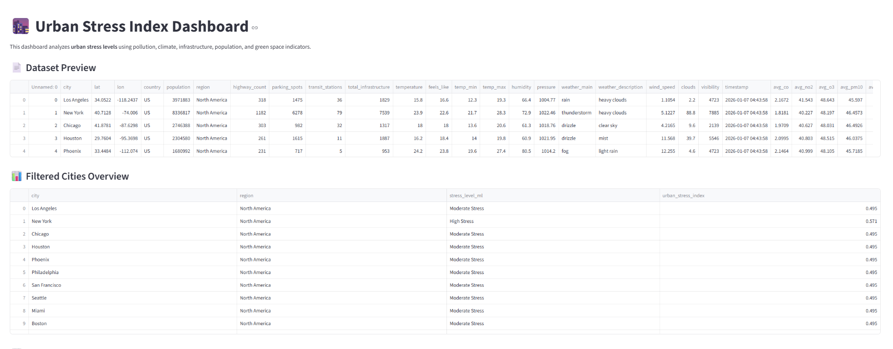
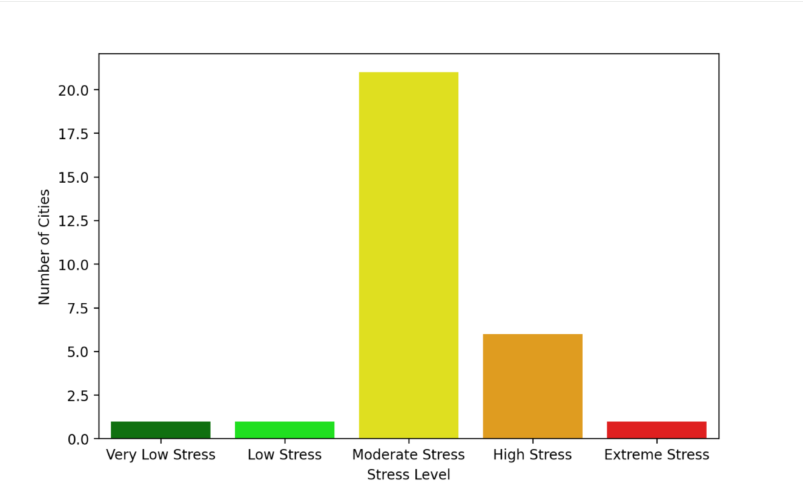
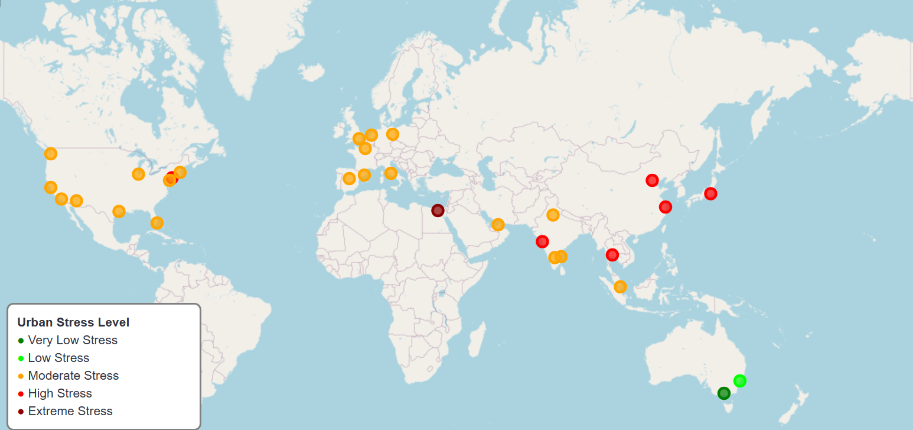
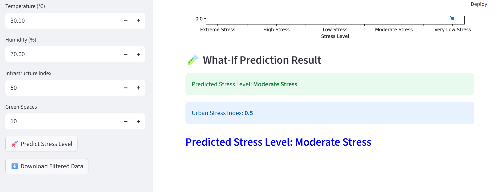

# 🌆 Urban Stress Index Analytics Dashboard

## 📌 Project Overview
The **Urban Stress Index Analytics Dashboard** is a data-driven web application designed to analyze, quantify, and visualize urban stress levels across cities. The project leverages **machine learning, data analytics, and interactive visualization** to evaluate how pollution, climate, population density, infrastructure, and green spaces contribute to urban stress.

This project demonstrates strong skills in **data preprocessing, exploratory data analysis (EDA), unsupervised learning, feature engineering, and dashboard development**, making it ideal for **Data Analyst, Business Analyst, and Entry-Level Data Scientist roles**.

---

## 🎯 Project Objectives
- Perform end-to-end **data analysis and preprocessing**
- Apply **unsupervised machine learning (K-Means clustering)**
- Create a normalized **Urban Stress Index (0–1 scale)**
- Classify cities into meaningful stress categories
- Build an interactive **Streamlit dashboard**
- Enable **What-If stress prediction** using user-defined inputs

---

## 🧠 Key Features (ATS-Optimized)
- Exploratory Data Analysis (EDA)
- Data Cleaning & Feature Scaling
- K-Means Clustering (Unsupervised Learning)
- Urban Stress Index Calculation
- Stress Level Classification
- Interactive Data Visualization
- Geo-Spatial Mapping (Folium)
- Scenario-Based Stress Prediction
- Dashboard UI/UX Design
- Python-Based Analytics Pipeline

---

## 🗂️ Dataset Description
The dataset integrates multiple urban indicators:

### Environmental Factors
- PM2.5, PM10
- NO₂, SO₂, CO, O₃

### Climate Factors
- Average Temperature
- Humidity

### Urban Factors
- Population
- Infrastructure Index
- Number of Green Spaces

📁 **Dataset File:** `urban_stress_index.csv`

---

## 🧪 Methodology

### 1️⃣ Data Preprocessing
- Missing value handling
- Feature selection
- Standardization using **StandardScaler**

### 2️⃣ Machine Learning Model
- **Algorithm:** K-Means Clustering
- **Optimal Clusters:** 5 (validated using Elbow Method)
- Purpose: Group cities based on stress-related features

### 3️⃣ Urban Stress Index Formula
- **Urban Stress Index = Pollution + Temperature + Population – Green Spaces**
- Scaled to **0–1 range** using MinMaxScaler

### 4️⃣ Stress Level Categories
- Very Low Stress
- Low Stress
- Moderate Stress
- High Stress
- Extreme Stress

---

## 🧪 What-If Stress Prediction Module
Users can simulate hypothetical urban scenarios by adjusting:
- Pollution levels
- Temperature
- Population
- Infrastructure availability
- Green space count

Predictions are generated only after user confirmation to ensure controlled evaluation.

---

## 📊 Visualizations & Analytics
- Stress Level Distribution
- Pollution Impact Analysis
- Green Space vs Stress Relationship
- Cluster-wise Feature Comparison
- Correlation Heatmap
- Top 10 Most Stressed Cities
- Interactive Geo-Spatial Stress Map

---

## 🖼️ Screenshots

> 📌 Add screenshots after deployment by uploading images to a `screenshots/` folder.

### 🔹 Dashboard Overview


### 🔹 Stress Level Distribution


### 🔹 Geo-Spatial City Stress Map


### 🔹 What-If Stress Prediction


---

## 🛠️ Tech Stack
- **Programming Language:** Python
- **Libraries:** Pandas, NumPy, Scikit-learn
- **Visualization:** Matplotlib, Seaborn, Folium
- **Web Framework:** Streamlit
- **Version Control:** Git & GitHub
- **Deployment:** Streamlit Community Cloud

---

## 🚀 How to Run Locally

### 1️⃣ Clone the Repository
```bash
git clone https://github.com/your-username/urban-stress-index-dashboard.git
cd urban-stress-index-dashboard

### 2️⃣ Install Dependencies
```bash
pip install -r requirements.txt

## 3️⃣ Run the Application
```bash
streamlit run app.py

## 🌐 Live Deployment

**🚀 Streamlit Community Cloud**

**🔗 Live App:**  
(Add your deployed URL here)

## 📈 Business & Real-World Use Cases

- Urban Planning & Smart City Development
- Environmental Risk Analysis
- Public Policy Decision Support
- Sustainability Research
- Data Analytics Portfolio Project

## 🔮 Future Enhancements

- Real-time pollution data integration (APIs)
- Time-series stress trend analysis
- Supervised ML stress prediction
- City-to-city comparison dashboards
- Automated policy recommendations

## 👤 Author

**Abishek**  
Data Analyst | Machine Learning Enthusiast
